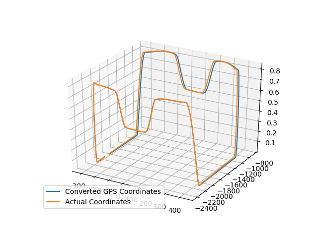

# Localization || Autonomous Vehicle
This project implements Unscented Kalman Filter for localization of an Autonomous Vehicle given sensors GPS and IMU. This project was initially developed for the competition Indy Autonomous Competition in which I participated under the Team Abhiyaan from IIT Madras. The example data given here is extracted from a simulation of the vehicle performing a lap around the track.

## Localization
In a self-driving car car, GPS (Global Positioning Systems) use trilateration to locate our position. In these measurements, there may be an error from 1 to 10 meters. This error is too important and can potentially be fatal for the passengers or the environment of the autonomous vehicle. We therefore include a step called **localization**.

Localization is a step implemented in the majority of robots and vehicles to locate with a really small margin of error. If we want to make decisions like overtaking a vehicle or simply defining a route, we need to know what’s around us (sensor fusion) and where we are (localization). Only with this information we can define a trajectory.

## Unscented Kalman Filter
The UKF addresses the approximation issues of the EKF. The state distribution is again represented by a GRV, but is now specified using a minimal set of carefully chosen sample points. These sample points completely capture the true mean and covariance of the GRV, and when propagated through the true non-linear system, captures the posterior mean and covariance accurately to the 3rd order (Taylor series expansion) for any non-linearity. To read more about UKF and how it works refer: [The Unscented Kalman Filter for Nonlinear Estimation](https://groups.seas.harvard.edu/courses/cs281/papers/unscented.pdf).

Here I used the Unscented Kalman Filter package provided by [filterpy](https://filterpy.readthedocs.io/en/latest/kalman/UnscentedKalmanFilter.html) as a base to implement the localization module.

## Module

### Input and Output
The module gets the following data as it's sensor input:
- GPS
    - Position X, Y, Z
- IMU
    - Acceleration X, Y, Z
    - Angular Velocity X, Y, Z
    - Angular Acceleration X, Y, Z

The module then uses this input to predict the state of the vehicle which is a 9-dimensional vector given by:
- Position X, Y, Z
- Velocity X, Y, Z
- Yaw, Pitch and Roll

### Results
Seen below are the actual versus estimated state of the vehicle.

As seen above the localization moule very accurately preditcs the state of the vehicle.

## Usage
- `GPS.csv` contains the sennsor data and the real data. Replace this incase you want to use your own data for this module
- To install all dependencies run `pip install -r requirements.txt`
- To run the main module: `python USEKF.py`
